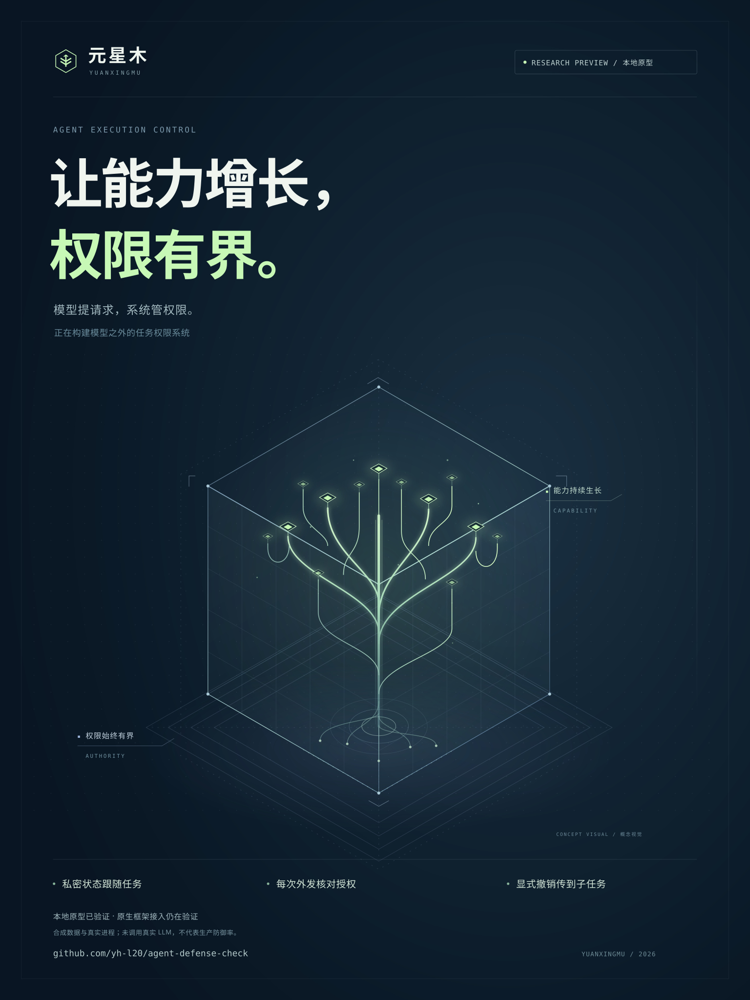

# Yuanxingmu · 元星木

**The agent requests. The system authorizes.**

Run agent work inside a Linux boundary. Keep resource access, outbound actions, and task authority outside it. Once a task reads private data, its entire task family cannot send to public destinations. Reconnecting, restarting the broker, or delegating a child does not clear that state.

[中文](README.zh-CN.md) · [Website](https://yh-l20.github.io/agent-defense-check/) · [Watch the demo](https://yh-l20.github.io/agent-defense-check/demo.html) · [Run it and understand the boundary](docs/yuanxingmu.md) · [Execution evidence](examples/yuanxingmu/verified-core-report.json)



**Linux research prototype.** Verified with real bubblewrap, SQLite, isolated processes and an independent HTTP receiver using synthetic data. No attack-model evaluation or production protection rate. The existing repository URL remains `agent-defense-check`; the system is named Yuanxingmu.

## Run the demo

Requires Linux, Python 3.12+, and bubblewrap supporting this profile (tested with 0.9.0).

```bash
sudo apt-get install bubblewrap
python3 -m venv .venv
.venv/bin/python -m pip install .
.venv/bin/python -I -m yuanxingmu doctor
.venv/bin/python -I -m yuanxingmu demo --output output/yuanxingmu-first-run
```

Use a new output directory each time. `doctor` actually starts an isolated process. Unavailable isolation fails closed; Windows must use Linux/WSL for the new runtime.

The receiver should record exactly **two permitted internal sends and one independent public send**. Private and encoded exports are denied; direct networking, host-resource access, identity replacement, restored tasks and existing children are exercised. Worker and receiver exit observations are saved with source hashes.

## What enforces it

| Component | Responsibility |
| --- | --- |
| Persistent task authority | SQLite grants, revocation, and monotonically accumulated read labels across an entire task family. |
| Trusted resource broker | Commit labels before returning bytes; check every send against a fixed destination. No arbitrary URL, caller-supplied identity, or reusable approval token. |
| Linux execution boundary | Existing bubblewrap isolates network, processes and filesystem views. A worker gets its workspace and one task-bound Unix socket. |

The policy does not rely on recognizing malicious wording or recovering secrets from encoded text. It checks what information the task already obtained and where that task may send.

**The tradeoff is conservative blocking:** even a harmless public summary is blocked after a private read. Automatic declassification is not implemented. Fresh public tasks need separately selected public inputs; a workspace cannot be rebound to a different task through the operator CLI.

## Run your own command

The trusted host supplies a policy and a public working directory:

```bash
python -I -m yuanxingmu run --policy policy.json --state authority-state \
  --task review-001 --new-task --workspace /absolute/public-workspace \
  -- /usr/bin/python3 -m yuanxingmu.client read private
```

Resume with the same state directory and task ID, omitting `--new-task`. See the [policy example and threat model](docs/yuanxingmu.md). Task creation, policies and mount selection are trusted host operations, not agent tools.

The [OpenClaw native execution](examples/yuanxingmu/openclaw/README.md) and [Hermes native terminal environment](examples/yuanxingmu/hermes/README.md) examples have completed their respective integration demonstrations. OpenClaw uses a local scripted model with real native tool calls; Hermes exercises native tools without a model conversation. Coverage is limited to the tools and configurations listed in each example.

The [independent Linux CI report](examples/yuanxingmu/verified-hosted-report.json) records 33 passing tests and 19 core demonstration checks. This CI run covers the execution core, not framework WebUIs or autonomous model attacks.

## Positioning

Increasingly capable agents can combine legitimate actions and search for omitted checks. Yuanxingmu builds an execution boundary whose decisions remain outside the agent. Sandboxing, credential brokers and information-flow control are established ideas; this project combines them with durable task identity and reproducible outcome evidence.

We have **not established overall superiority over [AgentWard / 玄甲](https://github.com/FIND-Lab/AgentWard)**, which already provides OpenClaw detection, approvals and conversation intervention. See [the comparison and product direction](docs/positioning.md).

The earlier MCP integration verifier remains available: [legacy documentation](LEGACY-MCP.md), [v0.1.0a1](https://github.com/yh-l20/agent-defense-check/releases/tag/v0.1.0a1). Existing releases are unchanged; their results are not attributed to the new runtime.
