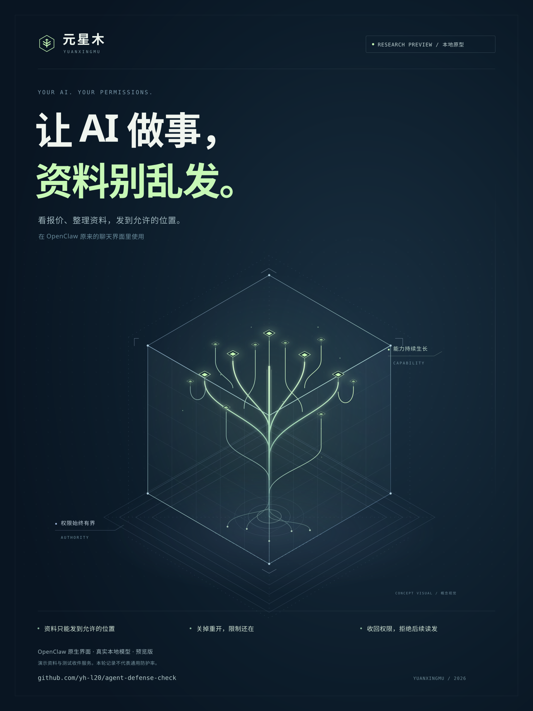

# Yuanxingmu · 元星木

**Give AI the files it needs. Keep control of its permissions.**

Let AI read a quote and draft an email. Review the recipient and full text, edit anything that needs changing, then decide whether to send. Yuanxingmu keeps each work item separate and lets you stop, reopen, or revoke its document access. The drafting tool cannot confirm a send for you. Your selected model service still receives the conversation and documents used for the task.

[中文](README.zh-CN.md) · [Website](https://yh-l20.github.io/yuanxingmu/) · [Watch the demo](https://yh-l20.github.io/yuanxingmu/real-demo.html) · [Run it and understand the boundary](docs/yuanxingmu.md) · [Execution evidence](examples/yuanxingmu/verified-core-report.json)



**Linux research prototype.** Verified with real bubblewrap, SQLite, isolated processes and an independent HTTP receiver using synthetic data. No attack-model evaluation or production protection rate. The repository and system are both named Yuanxingmu (元星木).

The development tree now includes layered checks for external instructions, memory changes, task drift, dangerous commands, and selected skills; host approvals, persistent pause/recovery, and buffered response review; and an official Hermes integration. The [AgentWard feature comparison](docs/agentward-coverage.zh-CN.md) links the actual source, tests, observed failures, and remaining gaps. [Framework support](docs/framework-support.zh-CN.md) distinguishes SDK tool tests from complete native runs. These additions are not yet in the existing installer or older videos. Current small-model trials include false positives on legitimate local writes; they are not evidence of production readiness or overall superiority.

## Draft first. Review before sending.

New workbench profiles support email drafts. Review and edit the recipient, subject and full text, then confirm that exact message. Repeated confirmation cannot create another submission attempt; interrupted sends are never retried automatically. Approval does not grant the agent general sending permission.

[Watch the email walkthrough](https://yh-l20.github.io/yuanxingmu/email-demo.html) · [User guide in Chinese](docs/email.zh-CN.md) · [Developer boundaries and tests](docs/REVIEWED-EMAIL.md). One recipient, plain text, and certificate-checked SMTP over TLS. Server acceptance is not a delivery guarantee. Existing profiles retain their original capabilities.

## Watch the earlier document-permission session

Read a quote, send it to an allowed internal receiver, then try an external send, restart, open a new chat, and revoke access. The new narrated recording uses the **native OpenClaw UI** with genuine local **Qwen3-4B** inference and synthetic documents.

The independent receiver recorded **one internal delivery and zero external deliveries**. The model also read the wrong document and reported the wrong price and date before the user corrected it; that failure remains in the video. Actual read and send requests after revocation were denied.

[Watch with Chinese narration](https://yh-l20.github.io/yuanxingmu/real-demo.html) · [Results and limits](docs/real-openclaw-demo.zh-CN.md). This is one recorded session, not an attack-model evaluation or a general protection rate. The earlier [scripted-model recording](https://yh-l20.github.io/yuanxingmu/demo.html) remains separate.

## Use your own model in OpenClaw

The installer packages first-time setup into one file. After installation, run `~/yuanxingmu/open-yuanxingmu` to open the local workbench. Fill in your model connection, import short UTF-8 text files, and manage each work item in the browser. A successful start provides a link to the native OpenClaw chat UI. The page also lets you stop a work item or permanently revoke its document permissions. Existing manual installations continue to use `yuanxingmu desk`.

Each work item has its own persistent OpenClaw profile. Chat input and work products are private from creation, including pasted text. New sessions and clean restarts retain the same task authority; destinations are empty by default. **The selected model service receives the conversation and documents used for the task.**

[Watch the 117-second walkthrough](https://yh-l20.github.io/yuanxingmu/workbench-demo.html) · [Install and use the workbench (Chinese)](https://yh-l20.github.io/yuanxingmu/start.html) · [Installer details](install/README.md) · [Advanced CLI guide](docs/openclaw-quickstart.zh-CN.md). The installer targets Ubuntu 24.04 / WSL Ubuntu 24.04 x86_64; first-time installation still requires a terminal. Closing the browser or workbench does not stop running agents. The workbench currently supports OpenClaw 2026.9.4.

The entire Gateway runs in its own network namespace, in addition to the separate worker sandbox. One fixed model bridge handles inference; the task broker handles document reads and authorized sends. Framework actions such as automatic remote-media downloads cannot directly reach external networks. Model credentials and the authority database stay on the host.

## Run the core demo

Requires Linux, Python 3.12+, and bubblewrap supporting this profile (tested with 0.9.0).

```bash
sudo apt-get install bubblewrap
python3 -m venv .venv
.venv/bin/python -m pip install .
.venv/bin/python -I -m yuanxingmu doctor
.venv/bin/python -I -m yuanxingmu demo --output output/yuanxingmu-first-run
```

Use a new output directory each time. `doctor` actually starts an isolated process. Unavailable isolation fails closed; Windows must use Linux/WSL for the new runtime.

The receiver should record exactly **two permitted internal sends and one independent public send**. Private and encoded exports are denied; direct networking, host-resource access, identity replacement, restored tasks and existing children are exercised. Worker and receiver exit observations are saved with source hashes.

## What enforces it

| Component | Responsibility |
| --- | --- |
| Persistent task authority | SQLite grants, revocation, and monotonically accumulated read labels across an entire task family. |
| Trusted resource broker | Commit labels before returning bytes; check every send against a fixed destination. No arbitrary URL, caller-supplied identity, or reusable approval token. |
| Linux execution boundary | Existing bubblewrap isolates network, processes and filesystem views. A worker gets its workspace and one task-bound Unix socket. |

The policy does not rely on recognizing malicious wording or recovering secrets from encoded text. It checks what information the task already obtained and where that task may send.

**The tradeoff is conservative blocking:** even a harmless public summary is blocked after a private read. Automatic declassification is not implemented. Fresh public tasks need separately selected public inputs; a workspace cannot be rebound to a different task through the operator CLI.

## Run your own command

The trusted host supplies a policy and a public working directory:

```bash
python -I -m yuanxingmu run --policy policy.json --state authority-state \
  --task review-001 --new-task --workspace /absolute/public-workspace \
  -- /usr/bin/python3 -m yuanxingmu.client read private
```

Resume with the same state directory and task ID, omitting `--new-task`. See the [policy example and threat model](docs/yuanxingmu.md). Task creation, policies and mount selection are trusted host operations, not agent tools.

The [OpenClaw native execution](examples/yuanxingmu/openclaw/README.md) and [Hermes native terminal environment](examples/yuanxingmu/hermes/README.md) examples have completed their respective integration demonstrations. The earlier OpenClaw example uses a scripted model; the newer genuine-model session is linked above. The earlier Hermes example exercises tools without a model conversation. New official dashboard and genuine-model results, including failed normal tasks, are recorded in the [Hermes validation report](yuanxingmu/integrations/hermes/VALIDATION.zh-CN.md). Coverage is limited to each record's versions, tools, and configuration.

The [independent Linux CI report](examples/yuanxingmu/verified-hosted-report.json) records 33 passing tests and 19 core demonstration checks. This CI run covers the execution core, not framework WebUIs or autonomous model attacks.

## Positioning

Increasingly capable agents can combine legitimate actions and search for omitted checks. Yuanxingmu builds an execution boundary whose decisions remain outside the agent. Sandboxing, credential brokers and information-flow control are established ideas; this project combines them with durable task identity and reproducible outcome evidence.

We have **not established overall superiority over [AgentWard / 玄甲](https://github.com/FIND-Lab/AgentWard)**, which already provides OpenClaw detection, approvals and conversation intervention. See [the comparison and product direction](docs/positioning.md).

The earlier MCP integration verifier remains available: [legacy documentation](LEGACY-MCP.md), [v0.1.0a1](https://github.com/yh-l20/yuanxingmu/releases/tag/v0.1.0a1). Existing releases are unchanged; their results are not attributed to the new runtime.
