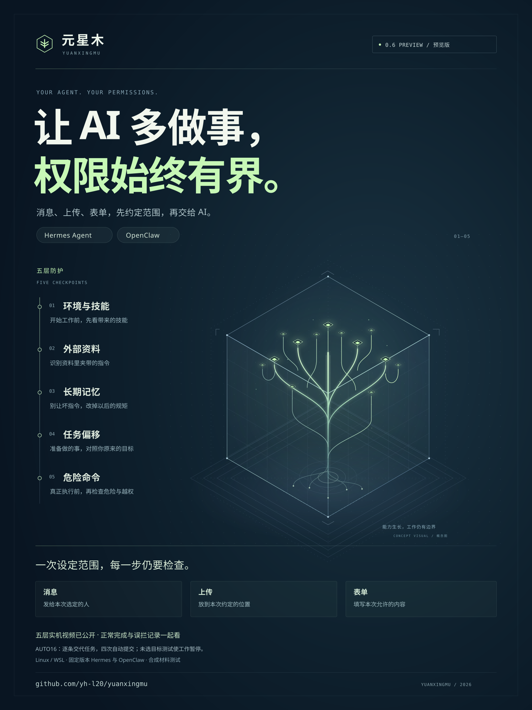

# 元星木 · Yuanxingmu

**让 AI 放手做事，权限始终有界。**

**0.6 预览版。** 0.6 核心运行包已就绪，配套的 0.3 一键安装器正在路上；当前实测记录仅供参考，尚不代表完整验收通过。

你可以先挑选好给 AI 查阅的资料，并圈定允许发送的固定对象，再让它帮你整理报价、发送通知、上传文本或填写表单。在授权范围内且通过安全审查的操作，AI 均可全自动执行；遇到疑虑，你也能随时一键暂停工作或撤回资料权限。请注意：你所接入的底座大模型服务仍会正常接收到聊天内容与相关资料。

当前源码集成了输入清洗、记忆防篡改、意图偏离对齐、危险命令拦截、技能与配置审计五层纵深防御，并提供人工终审、任务暂停/恢复、模型回复出站前审查以及与 Hermes 官方界面的无缝接入。我们在 [玄甲（AgentWard）逐项对照](docs/agentward-coverage.zh-CN.md) 中坦诚列出了全部源码实现、实测证据与现有缺口；在 [框架支持表](docs/framework-support.zh-CN.md) 中清晰区分了哪些仅是工具适配，哪些经过了完整实机验证。由于这批新特性尚未打包进旧版安装器，且实际测试中仍存在个别对正常操作的误拦截，我们绝不宣称已全面超越玄甲。

[五层防御真实中文实机演示](https://yh-l20.github.io/yuanxingmu/layers.html#hermes-five-layers)：基于 Hermes 与 GLM-5.2 的真实网页录屏，分别带你现场直击如何化解外部恶意指令、记忆投毒、意图偏移、高危 Shell 命令与恶意技能注入。实机视频绑定提交 `6881138`；关于新版自动化流程的[首发踩坑记录](docs/evidence/hermes-auto15-2026-09-12/REPORT.zh-CN.md)与[授权事实修正报告](docs/evidence/review-facts-2026-09-12/REPORT.zh-CN.md)亦全部公开透明可查。

开发版最新上线了[一次性授权·范围内自动化作业](docs/automatic-work.zh-CN.md)机制：在创建任务时预先指定可信对象后，只要通过安全检查，消息下发、数据上传与表单填写均可自主顺畅执行；被拦截扣留的恶意外部内容也不会再频繁打扰你手动恢复。目标白名单、资料权限范围与使用额度全由宿主机内核牢牢把关，当执行状态未知时绝不盲目重发。至于邮件起草等高敏感工具，则依旧保留人工确认环节。

[AUTO16 自动化实机测试实录](docs/evidence/hermes-auto16-2026-09-12/REPORT.zh-CN.md)中，系统成功完成了四次经过审查的真实数据交付，即使接触到被隔离的恶意资料，正常工作也未受中断；面对未授权的陌生目标，系统精准实施了前置阻断，完整保留了真实的失败回溯。[待审核动作修正记录](docs/evidence/pending-effect-2026-09-12/REPORT.zh-CN.md)原汁原味公开了原始请求流水、判定结果以及当前依然存在的模型漏检和格式解析失败，绝不拿受控的单元测试冒充通用防护率。

[2 分 02 秒直击：AUTO16 自动化全流程实录](https://yh-l20.github.io/yuanxingmu/layers.html#hermes-auto16-flow)：你只需清晰交代工作目标，白名单之内的常规操作无需你次次点批准。视频绑定提交 `a34dafb`；在 08 步创建待审申请前曾触发过一次误拦，相关后续动作已安全阻断未执行。

我们选择毫无保留地公布测试中的“翻车现场”：

- [AUTO17 实机记录](docs/evidence/hermes-auto17-2026-09-12/REPORT.zh-CN.md)：三次自动化提交虽顺利送达，但因大模型参数格式错误导致上传未启动。随后系统真实生成了待审申请，高危 Shell 命令被底层规则稳稳拦死，即使新开聊天也无法绕过限制继续调用。本轮正常业务流程与全流程协议均未算作通过。
- [AUTO18 实机记录](docs/evidence/hermes-auto18-2026-09-12/REPORT.zh-CN.md)：在一次日常任务中，系统虽正确完成了三项自动化提交，但**内部底价信息竟混入了展示给用户的两条聊天回复中，而内容审查模型两度判定失误予以放行**（两次的判定格式本身均完全合规）。鉴于恶意数据在接触工作大模型之前已被隔离，此案属于纯粹的回复漏检与内容外泄，**并无证据表明存在越狱或提示注入攻击成功**。顺利完成三次数据提交，绝不等于安全协议整体达标。

AUTO17 与 AUTO18 的测试现场均严格绑定提交 `e886607`。后续的任何代码修补都不会篡改这两份既定记录，更不能代替真实环境下的二次实测。

[English](README.md) · [官网](https://yh-l20.github.io/yuanxingmu/) · [五层防御详解](https://yh-l20.github.io/yuanxingmu/layers.html) · [实机演示视频](https://yh-l20.github.io/yuanxingmu/real-demo.html) · [部署运行指南与安全边界](docs/yuanxingmu.md) · [核心验证实录](examples/yuanxingmu/verified-core-report.json)



必须坦诚说明：这是一个诞生于 **Linux 环境的本地开源安全研究原型**。所有防护机制均跑在真实的 Linux bubblewrap、SQLite 状态引擎、独立 HTTP 接收网关与测试数据集上；我们没有私下接入对抗攻击模型，也不承诺具备生产级的百分之百防御率，更尚未对接复杂的企业级 IAM 系统。目前项目所有公开命名均已统一定名为“元星木（Yuanxingmu）”。

## 拟好草稿，最终拍板权仍在你的手中

新版桌面工作台原生支持了智能邮件草稿机制。当 AI 整理好回复并提交草稿后，你依然拥有绝对的主导权——可以从容修改收件人、润色主题与正文细节，保存并逐字复核后，再亲手点击确认投递。即便你手抖连点，系统也做了防重复提交保护；若网络中断，也绝不会未经许可在后台盲目重发。最重要的是：即便你单次批准了一封邮件，也绝不等于赋予了 AI 永久向外发信的绿灯。

[观看邮件实机演示视频](https://yh-l20.github.io/yuanxingmu/email-demo.html) · [三分钟发出你的第一封安全邮件](docs/email.zh-CN.md)。目前该功能聚焦于单收件人、纯文本内容与严格加密的邮件传输通道。需要提醒的是：邮件服务商接收入库并不完全等于对方已读，若发送状态存疑，建议先登录邮箱服务台核验。此外，历史旧任务不会被强制静默升级此功能。

## 看看最初的资料隔离与权限演练

我们曾让 AI 提取一份商业报价，将其安全发送至指定的内部接收点，随后故意诱导它尝试向外部陌生地址泄露、重开新会话试图越权、并最终当场收回全部数据权限。这段实机视频全程录制于 **OpenClaw 原生客户端**，驱动其思考与工具调用的则是完全跑在本地的 **Qwen3-4B** 开源小模型。

在整个测试实录中，内部受信任服务稳稳收到了 **1 条** 业务消息，而外部探针收到的泄露数据始终为 **0 条**。测试中 AI 同样犯过迷糊——它读错过文件、算错过报价金额，甚至记混过交付日期，但我们全部原汁原味地保留在了录屏里。当人工在后台点击收回权限后，AI 后续发起的一切文件读取和网络外发动作均被就地拦截。

[观看带解说的实测视频](https://yh-l20.github.io/yuanxingmu/real-demo.html) · [核对完整测试结果与边界局限](docs/real-openclaw-demo.zh-CN.md)。该测试基于模拟业务数据和专用测试接收端完成；这是一份真实严肃的运行日志记录，绝非包装出来的商业宣传防护率。对于更早期的[脚本模型对照演示](https://yh-l20.github.io/yuanxingmu/demo.html)，我们也单独做了归档留存。

## 自主接入你的模型与私有数据

为了降低上手门槛，我们把环境初始化的繁琐步骤浓缩进了一键安装脚本中。安装完成后，只需在终端敲入 `~/yuanxingmu/open-yuanxingmu` 即可拉起本地可视化工作台。你可以在清爽的界面里填入自定义的模型 API 地址、一键导入本地知识文本、创建专属任务并顺畅唤起熟悉的 OpenClaw 原生界面。日常想要临时挂起工作、或是永久收回某份敏感资料的阅读权限，在网页后台都能轻松搞定。习惯纯终端操作的老用户也可继续使用经典的 `yuanxingmu desk` 命令行。

每项任务的资料与权限均被物理隔离在独立的沙盒沙箱中。你在聊天框中随手粘贴的代码、以及 AI 演算出的中间成果，自生成之日起就被系统严格视作高保密资产；哪怕你频繁切换会话或重启系统，底层权限标签依然坚挺有效。在默认状态下，系统杜绝开放任何多余的出站网络通道。**但请切记：你所选择的上游大模型提供商（API），依然能够在网络请求中看到你的聊天记录与发起的上下文资料。**

[117 秒极速上手指南](https://yh-l20.github.io/yuanxingmu/workbench-demo.html) · [手把手安装并配置工作台](https://yh-l20.github.io/yuanxingmu/start.html) · [一键安装器技术手册](install/README.md) · [进阶命令行深度指南](docs/openclaw-quickstart.zh-CN.md)。安装包专为 Ubuntu 24.04 / WSL Ubuntu 24.04 x86_64 环境深度调优，初次配置仅需极简的命令行操作。随手关掉浏览器网页或工作台面板并不会强杀后台正在计算的 AI 进程。当前版本深度适配 OpenClaw 2026.9.4。

除了隔离工具的系统调用之外，新版网关还直接将整个 OpenClaw 宿主环境关进了受控的网络命名空间中。所有发往大模型的推理请求必须途经固定审查通道，资料的调阅与外发必须严密经过权限 Broker 代理；就连很多 AI 框架在后台偷偷下载远程多媒体资源的隐蔽动作，在底层网络隔离下也会被当场掐断。所有的 API 密钥与权限数据库均被安全封锁在宿主机一侧。

## 深入检查底层硬隔离机制

运行元星木需要 64 位 Linux 环境、Python 3.12+ 以及支持独立用户命名空间特性的 bubblewrap（已验证 0.9.0+）。在 Ubuntu/WSL 下的快速启动范式：

```bash
sudo apt-get install bubblewrap
python3 -m venv .venv
.venv/bin/python -m pip install .
.venv/bin/python -I -m yuanxingmu doctor
.venv/bin/python -I -m yuanxingmu demo --output output/yuanxingmu-first-run
```

请确保每次执行测试都指定全新的输出目录名称。`doctor` 自检命令会真实尝试在内核中创建沙箱环境；若环境不满足安全要求则会即刻报错中止，绝不会偷偷妥协退回到不安全的宿主机明文执行。Windows 用户请务必在 Linux/WSL 子系统内部署运行新版核心。

演示套件会同时验证“守得住”与“做得了”两个方面：既要证明加密后的私密文本无法被偷运外发、宿主敏感目录与鉴权数据库无法被越权读取，即使中途强行重启 broker 进程、正在运行的子任务依然受到严格限制；又要确保在授权目的地这一端，独立接收网关能够精准记录到 **2 次合规的内部交付，以及 1 次经审查的安全公开发送**，随后全体工作进程干净利落地安全退出。

## 系统的三大核心支柱

| 核心组件 | 职责与技术实现 |
| --- | --- |
| 任务权限账本 (Task Authority) | 精确记录每个任务允许调阅的资源清单、允许投递的目标白名单，以及该任务调用树已经接触过的全部数据污点标签。权限状态只收紧不放宽，顶层权限的显式撤销将强制贯穿覆盖所有派生的子任务。 |
| 数据与出站代理服务 (Broker) | 遵循“先记账、后交货”原则：先在持久化数据库中落盘读取凭证，再交付文件数据；在发起任何外部网络交付时，重新比对终点与任务标签。仅认预先在宿主机配置的白名单 ID，绝不轻信来自模型或网络请求中自报的身份声明。 |
| Linux 操作系统沙箱 (Sandbox) | 基于原生 bubblewrap 剥离直接外网访问权、隐藏宿主机 Home 根目录与安全凭证库；仅以极小化原则挂载当前工作目录，并分配该任务专属的受控 Unix 域套接字。 |

我们始终坚持：**防线应当取决于任务到底实际摸过了什么敏感资料，而不是寄希望于大模型猜测这句提示词是不是恶意的。** 攻击者无论是试图在请求里伪造不同的 task ID、偷偷更换 Socket 连接，还是把窃取的机密文字进行 Base64、Hex、Unicode 等各种变形混淆编码，在底层的数据标签追踪下都无法拓宽半分权限。

**安全必须付出明确的代价：凡是未被预先授权接收机密资料的目标，哪怕 AI 只是想给它发一份无害的公开摘要，也会被系统从严阻断。** 在创建任务阶段，你可以一次性明确授权某个可信服务接收相关交付物，但系统绝不会因此擦除数据自身的污点安全标签，更绝不允许绕过硬性正文禁令。当前版本尚未集成复杂的自动化脱敏算法；若需生成面向公众的安全交付物，必须在全新的空工作目录下、以受信任的宿主指令启动全新的独立任务。切记：同一工作目录绝不可混用多个不同安全等级的任务身份。

## 运行自定义命令范式

受信任的宿主机管理员可预先配置好资源与目标映射文件，随后从容调起受控环境：

```bash
python -I -m yuanxingmu run --policy policy.json --state authority-state \
  --task review-001 --new-task --workspace /absolute/public-workspace \
  -- /usr/bin/python3 -m yuanxingmu.client read private
```

如需在中断后恢复现场，只需指定相同的状态存储目录并保留相同的 `--task` 标号（去掉 `--new-task` 参数即可）。更详尽的策略模板与网络外发案例请参阅 [完整运行说明](docs/yuanxingmu.md)。务必牢记：策略文件的编排、任务生命周期管理以及工作目录的选择必须由受信任的人类管理员主导，切不可将该入口直接暴露给被沙箱保护的 Agent 自由调用。

我们已分别完成了对 [OpenClaw 原生客户端](examples/yuanxingmu/openclaw/README.md) 与 [Hermes 终端交互环境](examples/yuanxingmu/hermes/README.md) 的实机对接与录屏演示。早期的 OpenClaw 演示主要基于本地脚本驱动的 Mock 模型；而最新的大模型端到端评测实况请参考前文附带的实录视频。早期的 Hermes 用例侧重于打通工具链调用链路；关于接入官方 Web 界面后搭配主流商用模型的完整评测报告、各项拦截效果及失败案例分类，欢迎深入阅读 [Hermes 实机评测与归因报告](yuanxingmu/integrations/hermes/VALIDATION.zh-CN.md)。需要说明的是：所有测试结果仅对各报告中明确标明的软硬件版本、工具集与特定配置负责。

由 [独立 Linux CI 自动化矩阵](examples/yuanxingmu/verified-hosted-report.json) 留存的归档记录中，完整涵盖了 33 项核心测试用例与 19 项沙箱运行演示结果。该流水线旨在持续检验底层的执行核心与安全机制，并不代表已经历过面向这两大框架 WebUI 界面的全量生产级模型对抗攻防渗透。

## 我们为什么要做这个项目

随着前沿大模型推理与规划能力的跃升，潜在攻击者越来越擅长将合法的系统工具巧妙组合、在大规模并行尝试中寻找微小的安全规则盲区。元星木选择跳出“在模型内部打补丁”的传统思维，将**“这件事情物理上究竟能不能做成”**的裁决权彻底收归到大模型之外，致力于为现有的各类自主 Agent 构筑一道坚不可摧的操作系统级权限防线。Linux bubblewrap 沙箱、凭证隔离代理以及信息流污点控制（IFC）在传统系统安全界已有成熟积淀；而我们所探索的，正是将任务专属身份、持久化数据访问控制与真实系统调用边界有机融为一体。

我们必须诚实地指出：我们从未在整体功能上宣称已经超越了浙江大学系统安全实验室的 [AgentWard / 玄甲](https://github.com/FIND-Lab/AgentWard)。玄甲在面向 OpenClaw 的多层检测、动态审批与交互式会话干预领域已经构建了极其完备的标杆体系；元星木所尝试探索并落地验证的，是扎根在操作系统底层、更为硬核的物理执行隔离与不可逆动作防御层，详细的技术路线对照请参阅 [架构定位与深度对比](docs/positioning.md)。

本项目最初用于 MCP 协议接入验收的工具集以及已发布的 `v0.1.0a1` 历史版本均完整保留备查：详见 [早期版本归档说明](LEGACY-MCP.zh-CN.md)。新版架构并不覆盖旧版本的实现，我们也绝不会将早期的玩具实验拿来充当新一代安全核心的验证背书。
