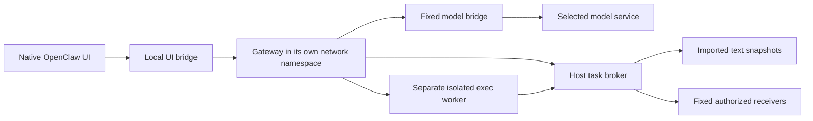

# Dedicated OpenClaw runtime

The `yuanxingmu openclaw` commands create a separate OpenClaw 2026.9.4 instance. See the [user guide](openclaw-quickstart.zh-CN.md) for installation and daily use. This profile is intended for text-document work on Linux/WSL; it does not retrofit an existing personal Gateway or enable its plugins and channels.

## What is private

Every profile starts with the `private` label, committed with task creation. This covers text pasted into chat, retained conversation history, imported documents and work products. It does not claim that pasted input passed through a document-read tool. All sessions and clean restarts keep the same authority identity. There is no automatic declassification or public-send exception for apparently harmless summaries.

The selected model service receives the conversation and any documents used in it. It is an explicitly trusted recipient. Default destinations are empty. An operator may supply fixed JSON receiving endpoints; each endpoint that accepts this profile's work must have `labels: ["private"]`. This transport is not a native Slack, Feishu or email integration.

## Two execution boundaries

The Gateway has no network route to the host or Internet. Its loopback listeners forward to narrow Unix sockets: one for the native UI and one for model requests. The host model bridge accepts only `POST /v1/chat/completions`, selects the upstream itself, injects the host-held credential, and refuses redirects and ambiguous HTTP framing. It forwards streaming responses without retaining conversation bodies. Requests made by the framework outside normal tools, such as remote `MEDIA:` downloads, remain inside the Gateway's network namespace.

The Gateway sees only the selected runtime files, read-only configuration and plugin, its own persistent OpenClaw state, workspace and logs. It cannot see the host model key, authority database or original documents. Native `exec` creates a further worker namespace with no access to the Gateway's loopback services or operator/model sockets. It receives only the workspace, trusted worker code and its fixed task-broker socket.

The allowed tool list is exactly `exec`, `yuanxingmu_read`, `yuanxingmu_send` and `yuanxingmu_status`, at both global and sandbox levels. Elevated execution, browser tools, channels and periodic jobs are disabled. File operations are limited to the workspace, and automatic favicon fetching is disabled. Adding other tools or plugins requires a new review; installing the plugin into an unrelated Gateway does not provide these guarantees.

## Lifecycle and recovery

- `init` creates a new directory, snapshots UTF-8 documents up to 256 KiB each, and binds the model, task, configuration and runtime. It refuses to overwrite an existing directory.
- `start` checks immutable file hashes, directory/ledger identity and the original authority family. Missing state or changed bindings fail; they do not create a new task. Readiness requires an authenticated Gateway health RPC with this instance's token.
- `status` reports persisted authority and service status without returning model credentials or the Gateway token.
- `revoke` permanently denies subsequent broker reads and sends. The owner can also use `/yuanxingmu-revoke` in the native UI. It requires authenticated `operator.admin`; it is not a model tool. Local computation can continue.
- `stop` closes the supervised Gateway and worker process tree, then records confirmed cleanup. A cleanly stopped, active task can resume. Loss of contact after a crash is reported as `interrupted` or `unconfirmed`, never assumed to be a clean stop.

Already-authorized network sends may complete before revocation obtains the broker lock. `unknown` and `unconfirmed` send outcomes do not mean “not received.” The broker records intent and outcome separately; validate delivery against the receiving service.

## Scope

The trusted computing base includes Linux, bubblewrap, the Python broker/supervisor/model bridge, Node/OpenClaw and the selected plugin/runtime files. This shares the host kernel and currently provides no memory, CPU or disk quotas. The native UI is served only on local loopback and requires its generated token. Other local processes under the same OS user and the human operator are trusted.

This boundary controls access and side effects. It does not make model answers correct, prevent an authorized user copying text elsewhere, or establish a protection rate against stronger models. The original scripted demonstrations remain versioned separately from genuine-model smoke tests.
